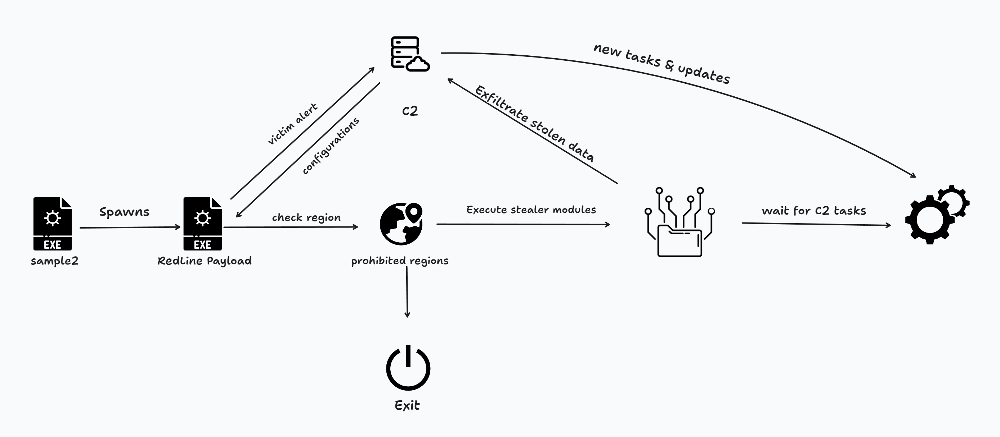
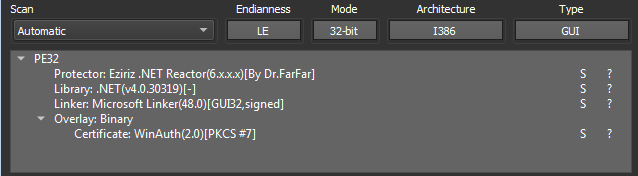
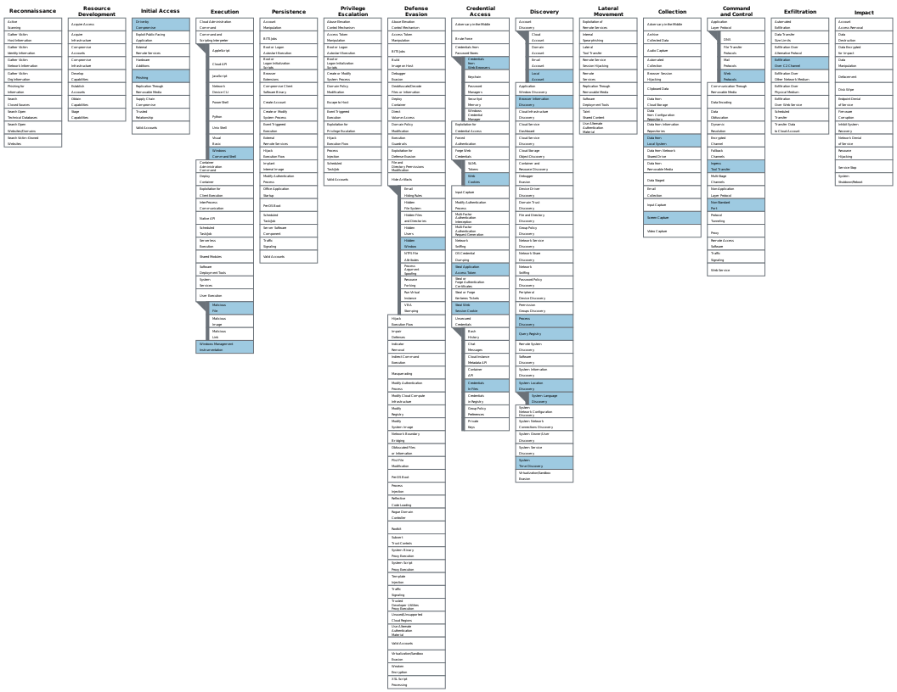

## Introduction

Redline stealer is one of the most popular info stealers out there. The malware is available for sale on underground forums for a different subscription options. The malware has a large set of stealing modules. It harvests: 

- Victim information (such as hostname, hardware specs, location, and live screenshot)
- Browser data (such as saved passwords, cookies, and autofill fields)
- Crypto wallets
- Telegram data
- Discord tokens
- Specific files from the victim machine
- FTP server credentials
- Game launcher data (Steam login files)
- VPN credentials

Also, it has a component that can be used as a loader to execute other malware families or download a newer version of the stealer. 

The attack flow can be represented by the following graph:



## Analysis

### Sample Unpacking

To get an overview of the sample I’m dealing with, I use `Detect It Easy` to get some basic information about what the Programming language is used and if there is known Packer/Obfuscator used.



The sample is written in .NET and uses a protector .NET Reactor. This is a commercial protector but, in most cases, it is just a generic rule that matches many packers. 

Opening the sample in `dnSpyEx` to see what’s going on. 


There are no strings, and the control flow is not so good. Now I will focus on restoring the strings first. Trying the default options of `de4dot` gives us the following result.


Not too much happened. sill no strings. Now I must get the method that did the string deobfuscation to instrument `de4dot` to decrypt the strings.

I noticed that the method `tLZpq04kop` takes an integer number. This could be an index of string table. 


The sample references a resource named `F1EpF55XYo6TY0Asiq.kluPYdoAXZXQRoIC8u` which consists of some bytes. it Also references `RSACryptoServiceProvider.UseMachineKeyStore` so it might be used in the string decryption process. without going into details, we know enough to use `de4dot` to decrypt the strings. 

Using the following command, I gave `de4dot` a hint about where the decryption function is. 

```python
de4dot.exe sample2 --strtyp delegate --strtok 06000133
```

The result, the strings appeared finally. 


After spending some time trying to get an idea of what it is trying to do. The sample did some things that did not look malicious. print some Russian sentences, it looks like a game. The sample did not look like it was the final payload, it was a loader that executes the final payload process. I found a noticeably big array that might be the encrypted payload but first I need to verify my assumption. 

 I decided to execute the sample and watch what will happen. The sample Spawns another process and exit. so, my assumption is right -I guess-. 


- Reddish color means exited process.

To extract the final payload, I will use https://github.com/hasherezade/hollows_hunter with `/loop` option to scan the memory all the time. It will detect and extract the injected code. 

I wanted to verify that it was unpacked right so, I used unpacme and here is the report [UnpacMe Results d1fe4cf589c8852fbc60fdcdc39bf944e27ccc2ae634b98ee841d9a9c4c6f55f](https://www.unpac.me/results/b17f5121-0485-499e-9c70-41a66186dbb8)

It Extract 2 child processes, hollows hunter just got one. one of the children is the same as the one extracted with `hollows_hunter` and the second one is a DLL named `RGBCore.dll`. 

### It is RedLine!

After skimming over the functions in `dnSpyEx` I see some functionality that the thieves should have. So, to make sure that the guess was right and to get the malware family too, I uploaded the sample to [VirusTotal](https://www.virustotal.com/gui/file/d1fe4cf589c8852fbc60fdcdc39bf944e27ccc2ae634b98ee841d9a9c4c6f55f/detection). And it immediately triggered a lot of AV vendors because it is the infamous `Redline Stealer`.

By opening the sample in `dnSpyEx` , the payload is not obfuscated. only the configuration encrypted and will discuss that in a moment.


The malware executing a thread to execute empty hidden message box. 

### C2 server decryption

Inside `MessageBox.Show` method there is an interesting method named `StringDecrypt.Decrypt` .


The method takes two arguments: `string b64` and `string stringKey` . The first argument is the target string and the second is the key to decrypt the string. The decryption method is quite simple it consists of:

- Decode Base64 string.
- XOR the decoded string with the Key.
- Decode the resulting string using Base64.

The malware then instantiate  `EndpointConnection()` object to use in connecting to C2 server. 


It then resolves the C2 server IP address. The configuration of the malware is hardcoded in the `EntryPoint` class. 


To get the configuration we can use CyberChef (For now, C2 extractor will be explained & implemented at the end of the report).


The configuration used in this sample:

```
IP = "46.8.19.196:53773"
ID = "ytmaloy8"
Message = ""
Key = "Pythonic"
```

If there are multiple C2 IP addresses, they will be separated by `|` but in this case, only one IP is used. 

The malware will try to send HTTP request to the IP using `endpointConnection.RequestConnection` and wait for the response. 

### Malware Configuration

The malware continues to prepare some structures and objects. The next thing is to declare  `ScanningArgs` Class to hold the types of information that the stealer will grab. The configuration is received from the C2 Server. And  `ScanResult` structure to hold some collected information about the victim machine. 


The following snippet is a cleaned version of the `ScanningArgs` Class. 

```csharp
[DataContract(Name = "ScanningArgs", Namespace = "BrowserExtension")]
public class ScanningArgs
{
	[DataMember(Name = "ScanBrowsers")]
	public bool ScanBrowsers { get; set; }
	[DataMember(Name = "ScanFiles")]
	public bool ScanFiles { get; set; }
	[DataMember(Name = "ScanFTP")]
	public bool ScanFTP { get; set; }
	[DataMember(Name = "ScanWallets")]
	public bool ScanWallets { get; set; }
	[DataMember(Name = "ScanScreen")]
	public bool ScanScreen { get; set; }
	[DataMember(Name = "ScanTelegram")]
	public bool ScanTelegram { get; set; }
	[DataMember(Name = "ScanVPN")]
	public bool ScanVPN { get; set; }
	[DataMember(Name = "ScanSteam")]
	public bool ScanSteam { get; set; }
	[DataMember(Name = "ScanDiscord")]
	public bool ScanDiscord { get; set; }
	[DataMember(Name = "ScanFilesPaths")]
	public List<string> ScanFilesPaths { get; set; }
	[DataMember(Name = "BlockedCountry")]
	public List<string> BlockedCountry { get; set; }
	[DataMember(Name = "BlockedIP")]
	public List<string> BlockedIP { get; set; }
	[DataMember(Name = "ScanChromeBrowsersPaths")]
	public List<string> ScanChromeBrowsersPaths { get; set; }
	[DataMember(Name = "ScanGeckoBrowsersPaths")]
	public List<string> ScanGeckoBrowsersPaths { get; set; }
}
```

The following snippet is a cleaned version of the `ScanResult` structure. 

```csharp
[DataContract(Name = "ScanResult", Namespace = "BrowserExtension")]
public struct ScanResult
{
	[DataMember(Name = "Hardware")]
	public string Hardware { get; set; }
	[DataMember(Name = "ReleaseID")]
	public string ReleaseID { get; set; }
	[DataMember(Name = "MachineName")]
	public string MachineName { get; set; }
	[DataMember(Name = "OSVersion")]
	public string OSVersion { get; set; }
	[DataMember(Name = "Language")]
	public string Language { get; set; }
	[DataMember(Name = "ScreenSize")]
	public string ScreenSize { get; set; }
	[DataMember(Name = "ScanDetails")]
	public ScanDetails ScanDetails { get; set; }
	[DataMember(Name = "Country")]
	public string Country { get; set; }
	[DataMember(Name = "City")]
	public string City { get; set; }
	[DataMember(Name = "TimeZone")]
	public string TimeZone { get; set; }
	[DataMember(Name = "IPv4")]
	public string IPv4 { get; set; }
	[DataMember(Name = "Monitor")]
	public byte[] Monitor { get; set; }
	[DataMember(Name = "ZipCode")]
	public string ZipCode { get; set; }
	[DataMember(Name = "FileLocation")]
	public string FileLocation { get; set; }
	[DataMember(Name = "SeenBefore")]
	public bool SeenBefore { get; set; }
}
```

The ID (`ReleaseID`) from the configuration is used in this structure with collected information. 

### Malware Core

The next call to `ResultFactory.sl9HSDF234` is used to populate these structures with collected data. 


It instantiated `ScanDteails` object that stores information about the grabbed information as shown in the Variables names.

### Geo location harvester and filter

The Method `ResultFactory.AKSFD8H23` is used to populate the `ScanResult` structure that stores information about the victim machine. 


The Important thing here is `GeoHelper.Get` method that populates the `GeoInfo` object.


The malware uses public websites to get information about the Geo location of the IP address by making a request to the website and parsing the response data. It tries three websites:

- https[://]api.ip[.]sb/geoip
- https[://]ipinfo[.]io/ip
- https[://]api.ipify[.]org

If any information were missing, it would be replaced with `UNKNOWN`. The Country and IP are checked against a Block List of countries and IPs that the malware gets from the configuration received from the C2 server. If There are any matches, the malware does not continue and exits immediately. 

### Real Stealer Action

Method `ResultFactory.Actions`  has some some other calls; it is the start of collecting victim info. 


This is how it looks like; each line of code contains a method call that collects a set of information. The names will be changed to some meaningful names as we go on. 

### Collecting Victim machine Information

Method `ResultFactory.asdkadu8` is used to get information about the victim computer: 

- The user domain name
- The computer name using `WindowsIdentity.GetCurrent().Name`
- Computer serial number using WMI Query `SELECT * FROM Win32_DiskDrive` and then get the serial number from the return data.


The MD5 checksum is calculated to the concatenated string. The value is then stored in `Hardware` member. 

The next method is `ResultFactory.sdfo8n234` 


As shown, it gets the location of the loaded assembly (Current EXE file) and stored in `FileLocation` member.

The next is `ResultFactory.sdfi35sdf` 


It collects the following information.

- computer Language (Keyboard layout) using `InputLanguage.CurrentInputLanguage.Culture.EnglishName` and stores the result in `Language` member.
- The Time Zone using `TimeZoneInfo.Local.DisplayName`  which get the readable name of the time zone for example `(UTC-08:00) Pacific Time (US & Canada)` and the value is stored in `TimeZone` member.
- The display Resolution using `DisplayHelper.GetDisplayResolution()` and format it in `<WIDTH>x<HEIGHT>`, the value is then stored in `ScreenSize` member.
- The Windows OS Version using `SystemInfoHelper.GetWindowsVersion()` and stores the result in `OSVersion` member. It decides if the architecture `x86` or `x64` using Environment.Is64BitOperatingSystem And to get the computer build and version info, It Query two registry values:

```csharp
SOFTWARE\\Microsoft\\Windows NT\\CurrentVersion\\ProductName
SOFTWARE\\Microsoft\\Windows NT\\CurrentVersion\\CSDVersion
```

The values are then concatenated to form `<WIN_VERSION_INFO> <ARCH>`. 


Then, the method `ResultFactory.sdf934asd` is called. 


It gets the computer name and stores it in `MachineName` member. 

The next is `ResultFactory.asdk9345asd` 


It gets information about the CPU using `GetProcessors()` that execute the Same WMI Query `SELECT * FROM Win32_Processor` and retrieves the name and number of cores from the result. The CPU info is stored in `SystemHardwares` with specifying `HardwareType` to be `HardwareType.Processor` (The other value is Graphics)

The next method `ResultFactory.a03md9ajsd` Add another element to `HardwareType` member. It adds graphics card information using `SystemInfoHelper.GetGraphicCards()` which works the same way as `SystemInfoHelper.GetProcessors()`. It executes WMI Query to get the graphics card information `SELECT * FROM Win32_VideoController`, and it stores the Adapter RAM and Name to `HardwareType` . 

### Collect Installed Browsers

The next one is `ResultFactory.asdk8jasd`. This method calls `SystemInfoHelper.GetBrowsers()` which as the name implies, Gets the Browsers.


It gets the list of all installed Browsers by querying the subkey `"SOFTWARE\\WOW6432Node\\Clients\\StartMenuInternet"` which contains a subkey for every installed browser. Then it loops over all the subkeys and gets the name, the executable path, and the version. The result is then stored at a Class to keep the Browser information:

```csharp
[DataContract(Name = "BrowserVersion", Namespace = "BrowserExtension")]
public class BrowserVersion
{
	[DataMember(Name = "NameOfBrowser")]
	public string NameOfBrowser { get; set; }
	[DataMember(Name = "Version")]
	public string Version { get; set; }
	[DataMember(Name = "PathOfFile")]
	public string PathOfFile { get; set; }
}
```

The next method is `ResultFactory.лыв7рыва2` 


It makes a new instance of `SystemHardware` class and fills it with the RAM size. 

```csharp
[DataContract(Name = "SystemHardware", Namespace = "BrowserExtension")]
public class SystemHardware
{
	[DataMember(Name = "Name")]
	public string Name { get; set; }
	[DataMember(Name = "Counter")]
	public string Counter { get; set; }
	[DataMember(Name = "HardType")]
	public HardwareType HardType { get; set; }
```

the function `SystemInfoHelper.TotalOfRAM()` gets the total amount of RAM using WMI Query `"SELECT * FROM Win32_OperatingSystem"` by reading `TotalVisibleMemorySize` of the resulted structure. 

### Capture Installed Programs and Firewall services.

The next method is `ResultFactory.ылв92р34выа`, which calls `SystemInfoHelper.ListOfPrograms()` 


It opens the Registry key `SOFTWARE\\Microsoft\\Windows\\CurrentVersion\\Uninstall` which has a subkey for every program installed on the system. It then opens every subkey and gets the Display Name of the program and the Version installed. The values are then added to an ordered list and stored in `ScanDetails.Softwares`.

The next call is to `ResultFactory.аловй` which just calls `SystemInfoHelper.GetFirewalls()` 


It uses WMI to get information about Firewalls, Antiviruses and AntiSpyWare. There is some kind of obfuscation as it adds `WindowsService` into the strings and then will be replaced. So, the values are.

```csharp
SELECT * FROM AntivirusProduct
SELECT * FROM AntiSpyWareProduct 
SELECT * FROM FisrewallProduct
```

And limiting the searching scope to `ROOT\\SecurityCenter2`, `ROOT\\SecurityCenter` namespaces which are not documented by Microsoft, but It Holds information about security solutions installed.  The malware then stores the Display name of the security solution found and its version in an ordered list`.ScanDetails.SecurityUtils`. 

### Capture Running Processes

The next function is `ResultFactory.ыал8р45` which calls `SystemInfoHelper.ListOfProcesses()` 


It uses WMI to get the list of running processes using the query `SELECT * FROM Win32_Process Where SessionId='<SESSION_ID>`, the session ID is retrieved from `Process.GetCurrentProcess().SessionId` which get the session ID for all the currently running processes. It stores `ProcessesID` , `Process Name` and `CommandLine`  for each process. Then it will be stored in a list and saved to `ScanDetails.Processes` .

The next method is `ResultFactory.ываш9р34` which calls `SystemInfoHelper.AvailableLanguages()`


This method is used to construct a list of all the installed Input languages and stored then in `ScanDetails.AvailableLanguages` 

### Screenshot capturer

The Next method is `ResultFactory.длвап9345` which calls `DisplayHelper.Parse()` 


This method is used to copy the content of the screen to a bitmap object (Takes a screenshot) and then convert the bitmap to an array of bytes (`DisplayHelper.ImageToByte(bitmap)`) and then stores the resulting array in `Monitor` member.

### Steal Telegram Data

The next method is `ResultFactory.ывал8н34` 


It checks if the member `ScanTelegram` member is set to True in the configuration. It it is the case, it instantiate an object from `FileScannerRule` . The function `FileScanner.Scan` did the scan work. 


in general, it gets all the files that met the specified pattern received from the C2 server. The file contents are saved `Body` attribute in `ScannedFile` class. `PathOfFile` , `NameOfFile` , `NameOfApplication` and `DirOfFile` of the target pattern are also stored. The malware uses `Overwrite` property in the methods so, this might be misleading as there are multiple implementations of the same method. The first one is `GetScanArgs`


This function is used to get the directory of telegram data `tdata`. It uses the information of the running Telegram process. If it fails, it will use the default installation path in the APPDATA folder. 

The second method is `GetFolder` which gets the Profile directory of the logged user. If it fails, it uses `Profile_Unknown` as default path.


### Steal Browsers Data

The Next function is `ResultFactory.вал93тфыв` 


It checks for `ScanBrowsers` in the configuration. Then it calls <Browser>.Scan() with the scan settings. All chromium-based browsers are handled by the first method which takes the paths of the target browsers as an argument. 


The malware looks for `Login Data`, `Web Data` and `Cookies` for each browser in the list. To copy these files, it calls a helper function `FileCopier.FindPaths` . The function `FindPaths`  build the path to `App Data`,`Program Files` and `Program Files (x86)`.


Then, it loops over all the files in every path of the paths list. Looking for the file names passed (Last argument).  and then saves the full path to the file in a list. Back to the `Scan` function, now `text2` in the loop will be the full path to `Login Data`, `Web Data` or `Cookies` file. Then it instantiates an object from `ScannedBrowser` class to hold the information collected.

```csharp
[DataContract(Name = "ScannedBrowser", Namespace = "BrowserExtension")]
public class ScannedBrowser
{
	[DataMember(Name = "BrowserName")]
	public string BrowserName { get; set; }
	[DataMember(Name = "BrowserProfile")]
	public string BrowserProfile { get; set; }
	[DataMember(Name = "Logins")]
	public IList<Account> Logins { get; set; }
	[DataMember(Name = "Autofills")]
	public IList<Autofill> Autofills { get; set; }
	[DataMember(Name = "CC")]
	public IList<CC> CC { get; set; }
	[DataMember(Name = "Cookies")]
	public IList<ScannedCookie> Cookies { get; set; }
```

It then checks the name of browser, if it contains `Opera GX Stable` set the `BrwoserName` to `Opera GX`. If it is not the case, it is a chromium-based browser so, it changes the path of the files to `%USERPROFILE%\\AppData\\Roaming\\<BROWSER_NAME>` and `AppData\\Local\\` if it returns an error. It gets the profile name by parsing the folder name before `User Data` folder and stores it in `BrowserProfile` . In the case of Chromium based browsers, this will be the browser name. 

Then, it saves the target data of the browsers’ local saved data.


It looks for `Passwords`, `Cookies`, `Autofill fields` and `Credit Card information`

 The first method in the browser stealer module is `ScanPasswords()`


First it adds `Login Data` to the passed path to get a full path which contains the encrypted passwords. It then calls `C_h_r_o_m_e.ParseLocalStateKey()` method. `ParseLocalStateKey`  is used to look for `Local State` or `LocalPrefs.json` files. 


Then, it retrieves the `encrypted_key` from `os_crypt` member, this key will be used later to crack the saved passwords.

Back to `ScanPasswords` , the next step to crack the passwords is to open `Login Data` database. but first it copies the file to temporary directory. After opening `Login Data`, it reads `logins` table. 

For each entry, it uses `Account` class instance to hold its information. 

```csharp
[DataContract(Name = "Account", Namespace = "BrowserExtension")]
public class Account
{
	[DataMember(Name = "URL")]
	public string URL { get; set; }
	[DataMember(Name = "Username")]
	public string Username { get; set; }
	[DataMember(Name = "Password")]
	public string Password { get; set; }
}
```

`URL` and `Username` are in clear text. The `Password` is encrypted, to decrypt it, uses `C_h_r_o_m_e.DecryptChromium` and passing the encrypted password and the previously saved `encrypted_key` .


The Result of the entire process is a clear text password and usernames associated with a URL, it saved in `scannedBrowser.Logins` .

The next method in the browser stealer module is `C_h_r_o_m_e.ScanCook` 


It gets the path to `Cookies` database by appending `Cookies` to the User Data full path. This is not valid path to the cookies database now, it moved to `Default\Network` under `User Data` Directory. Assuming it is right (In older version or any other reason) It opens a database connection to the copied `Cookies` file and gets its information to `ScannedCookie` class.

```csharp
[DataContract(Name = "ScannedCookie", Namespace = "BrowserExtension")]
public class ScannedCookie
{
	[DataMember(Name = "Host")]
	public string Host { get; set; }
	[DataMember(Name = "Http")]
	public bool Http { get; set; }
	[DataMember(Name = "Path")]
	public string Path { get; set; }
	[DataMember(Name = "Secure")]
	public bool Secure { get; set; }
	[DataMember(Name = "Expires")]
	public long Expires { get; set; }
	[DataMember(Name = "Name")]
	public string Name { get; set; }
	[DataMember(Name = "Value")]
	public string Value { get; set; }
}
```

The `Value` is decrypted using the same `C_h_r_o_m_e.DecryptChromium` method with the key from `Local State`. If the expiration value is below zero, it extends it by adding a large number. 

The next part of the Browser data stealing module is `C_h_r_o_m_e.ScanFills(dataFolder)`


In this function, it targets the Auto Saved fields of the browser which are stored in `Web Data` database. The functionality is like the previous method. it opens a database connection to `Web Data` and reads `autofill` table. Then, it saves the content (after decrypting the `Value` field) in `AutoFill` class which has only two attributes: `Name` and `Value`.

The last method in the browser data stealing module is `C_h_r_o_m_e.ScanCC` 


The method is also like the previous ones. It Opens `Web Data` database and read `credit_cards` table. Then, for each row, it stores the content of the credit card information (After decrypting the card number) in `CC` Class instance. —There is some kind of obfuscation which adds some random string and then removes it with a call to`. replace(string, string.empty)` —. 

```csharp
[DataContract(Name = "CC", Namespace = "BrowserExtension")]
public class CC
{
	[DataMember(Name = "HolderName")]
	public string HolderName { get; set; }
	[DataMember(Name = "Month")]
	public int Month { get; set; }
	[DataMember(Name = "Year")]
	public int Year { get; set; }
	[DataMember(Name = "Number")]
	public string Number { get; set; }
}
```

That’s all for the browser data stealing module for Chromium based browsers. There is another method used to get the data from `Gecko` Browser. But it harvests the cookies only, with the same method explained before but the data folder is different. 

### File Grabber

The next function in the Actions is `ResultFactory.вашу0л34` 


This method is used to grab files from the victim machine -If enabled-. The `RecoursiveFileGrabber.Scan` method is used to look for the file pattern in all the logical drives.


If the file is found in any place on the system. It creates an object of `ScannedFile` class. The body (Content) of the file is copied using the constructor method. Other information like `PathOfFile` , `NameOfFile` and `DirOfFile` are stored in the created object. This information is stored back into `ScanDetails.ScannedFiles` list.

### Steal FTP credentials

The next method is `ResultFactory.навева` 


It scans for `Filezilla` FTP server (if enabled in the configuration) using `FileZilla.Scan()` 


It looks for `FileZilla` directory in the App Data folder. Specifically, it searches for `recentservers.xml` and `sitemanager.xml`. For both, it calls `FileZilla.ScanCredentials` which loads the XML file and calls `FileZilla.GetRecent` to get the information stored in the XML file. It stores the FTP server information in `Account` object:

```csharp
[DataContract(Name = "Account", Namespace = "BrowserExtension")]
public class Account
{
	[DataMember(Name = "URL")]
	public string URL { get; set; }
	[DataMember(Name = "Username")]
	public string Username { get; set; }
	[DataMember(Name = "Password")]
	public string Password { get; set; }
} 
```

The URL is holding the `URL<:PORT>` and the username and password in their fields. 

### Steal Crypto Wallets

The next method is `ResultFactory.ащы9р34` 


It creates `ScannedFile` object that will be used to copy the found target files and its metadata. 

It looks for Crypto wallets. The method `browserExtensionsRule.ScanPaths`  is used to prepare a dictionary of the crypto-wallets browser extensions names and addresses. The method looks for a large set of extensions.

| ffnbelfdoeiohenkjibnmadjiehjhajb | YoroiWallet |
| --- | --- |
| ibnejdfjmmkpcnlpebklmnkoeoihofec | Tronlink |
| jbdaocneiiinmjbjlgalhcelgbejmnid | NiftyWallet |
| nkbihfbeogaeaoehlefnkodbefgpgknn | Metamask |
| afbcbjpbpfadlkmhmclhkeeodmamcflc | MathWallet |
| hnfanknocfeofbddgcijnmhnfnkdnaad | Coinbase |
| fhbohimaelbohpjbbldcngcnapndodjp | BinanceChain |
| odbfpeeihdkbihmopkbjmoonfanlbfcl | BraveWallet |
| hpglfhgfnhbgpjdenjgmdgoeiappafln | GuardaWallet |
| blnieiiffboillknjnepogjhkgnoapac | EqualWallet |
| cjelfplplebdjjenllpjcblmjkfcffne | JaxxxLiberty |
| fihkakfobkmkjojpchpfgcmhfjnmnfpi | BitAppWallet |
| kncchdigobghenbbaddojjnnaogfppfj | iWallet |
| amkmjjmmflddogmhpjloimipbofnfjih | Wombat |
| fhilaheimglignddkjgofkcbgekhenbh | AtomicWallet |
| nlbmnnijcnlegkjjpcfjclmcfggfefdm | MewCx |
| nanjmdknhkinifnkgdcggcfnhdaammmj | GuildWallet |
| nkddgncdjgjfcddamfgcmfnlhccnimig | SaturnWallet |
| fnjhmkhhmkbjkkabndcnnogagogbneec | RoninWallet |

Then, it reuses `FileScanner.Scan` to scan for the extensions. It adds some Rules or patterns for the search which are all the mentioned extensions and some other applications in the following list: 

The result data is stored in `ScanDetails.ScannedWallets` 

(All the folders are on `App Data` Directory) 

| Wallet Name | Target Files |
| --- | --- |
| Armory | Any file with .wallet extension in \\Armory folder |
| Atomic | All files in \\atomic folder |
| Coinomi | All files in \\Coinomi folder |
| Electrum | All files in \\Electrum\\wallets folder |
| Ethereum | All files in \\Ethereum\\wallets folder |
| Exodus | Exodus\\exodus.wallet and Any .JSON file in Exodus folder |
| Guarda | All files in \\Guarda folder |
| Jaax |  \\com.liberty.jaxx  |
| All Wallets: wallet.dat in App Data and App Data Local | Any file contains wallet in it.  |
| Browser Extensions | Extensions Folder in the browser Data Folder |

### Steal Discord Tokens

The next method is `ResultFactory.ыва83о4тфыв` 


 It is used to steal Discord tokens, this is done by `DiscordRule.GetTokens()` It scans the `%appdata%\\discord\\Local Storage\\leveldb` 


It searches for any `.log` and `.db` file in the discord app folder. And it uses the following Regex to filter out the result and get a specific wanted pattern `[A-Za-z\\d]{24}\\.[\\w-]{6}\\.[\\w-]{27}` 

The patterns get the data in format `<24 digit and letter>.<6 letters, digits or hyphens>.<27 letter, digit or hyphen>` . This pattern is matching for Discord Tokens. These Tokens are stored in `scanDetails.GameChatFiles` .

### Steal Steam data

The next Function is `ResultFactory.askd435`. 


The `GameLauncherRule` object two methods. `GetFolder` and `GetScanArgs` which are used in the same `Scan` Method.


It Reads the registry value `Software\\Valve\\Steam\\SteamPath` to get the installation path of Steam. It adds `**ssfn*`* as a searching pattern which searches for any file contains `ssfn` string. The `ssfn` files are used to login to steam account without 2FA. 

It adds another search target is `config` inside steam installation Directory and looks for `.vdf` files. Which stores metadata about the games installed and installation scripts. 

### Steal VPN credentials

The last method is `ResultFactory.sdi845sa` 


It makes a list of Nord VPN accounts, but the stealing functionality is not present.

It initiates two scans: one for `OpenVPN` files and the second for `ProtonVPN`. 

First, `OpenVPNRule` . it scans the folder `%USERPROFILE%\\AppData\\Roaming\\OpenVPNConnect\\profiles` for any `.ovpn` files. The stolen files will be stored in `ScanDetails.Open`.

Second, `ProtonVPNRule` . It scans the folder `%USERPROFILE%\\AppData\\Local\\ProtonVPN` for any `.ovpn` files. The stolen files will be stored in `ScanDetails.Open`.

This is the end of the Stealing functionality in the malware. And here is the action object After renaming the methods to represent its functionality. 


## All targeted data

The Data that the stealer is targeting can be summarized in the following table: 

| Attribute | Type | Value |
| --- | --- | --- |
| IPv4 | String | Victim’s IP address |
| City | String | Victim’s City |
| Country | String | Victim’s Country |
| ZipCode | String | Victim’s Zip Code |
| Hardware | String | MD5 hash of (User Domain + Username + Serial number) Used as a unique parameter of the victim.  |
| FileLocation | String | The path of the malware |
| Language | String | The language the victim machine |
| TimeZone | String | The time zone of the victim machine |
| ScreenSize | String | Screen size <Width>x<Height> |
| OSVersion | String | Windows version running on the victim machine |
| MachineName | String | Name of the logged in user |
| ScanDetails.SystemHardwares | List | Hardware information. CPU, GPU, and RAM |
| ScanDetails.InstalledBrowsers | List | List of all browsers installed |
| ScanDetails.Softwares | List | List of all installed programs |
| ScanDetails.SecurityUtils | List | List of all installed firewalls, antivirus, and antispyware |
| ScanDetails.Processes | List  | List of all running processes |
| ScanDetails.AvailableLanguages | List | List of all languages on the victim machine (Keyboard layouts used) |
| Monitor | Byte Array | Screenshot from the victim machine |
| ScanDetails.MessageClientFiles | List | List of stolen files from Telegram data files |
| ScanDetails.Browsers | List  | List of ScannedBrowers object that saves the stolen data from the installed browsers.  |
| ScanDetails.ScannedFiles | List | List of files to be sent to the attacker (File names and petterns recieved from C2 server) |
| ScanDetails.FtpConnections | List | List of Account object that stores the stolen credentials from FileZilla FTP server -if installed- |
| ScanDetails.ScannedWallets  | List  | List of stolen crypto-wallets local file and extensions data |
| ScanDetails.GameChatFiles | List | List of stolen discord tokens |
| ScanDetails.GameLauncherFiles | List | List of stolen steam account data and authentication files  |
| ScanDetails.NordAccounts | List  | List if Account object that stores stolen Nord VPN account credentials -Not Implemented- |
| ScanDetails.Open | List | List of Open VPN files (.ovpn) |
| ScanDetails.Proton | List | List of Proton VPN files (.ovpn) |

### Is it infected?

After collecting the user data. The malware does a check to see if the system is already infected or not.


It checks the folder `Yandex\\Yaddon` in the App Data folder. If the Folder exists, it returns True which means that it’s already infected. 

If it does not exist, returns False which means that it is not infected. So, it adds the directory as a mark of infection.

### Additional Features: Task runner and update manager

The Next Step is to Send the collected data. So, it makes HTTP request to the Opened connection to the C2 server with the collected data. 

The malware can receive malware updates and tasks from the C2 server. The received task parameters stored in `UpdateTask` object.

```csharp
[DataContract(Name = "UpdateTask", Namespace = "BrowserExtension")]
public class UpdateTask
{
	[DataMember(Nam
e = "TaskID")]
	public int TaskID { get; set; }
	[DataMember(Name = "TaskArg")]
	public string TaskArg { get; set; }
	[DataMember(Name = "Action")]
	public UpdateAction Action { get; set; }
	[DataMember(Name = "DomainFilter")]
	public string DomainFilter { get; set; }
}
```

The `TaskAction` Enum contains: 

```csharp
[DataContract(Name = "RemoteTaskAction")]
public enum UpdateAction
{
	[EnumMember]
	Download,
	[EnumMember]
	RunPE,
	[EnumMember]
	DownloadAndEx,
	[EnumMember]
	OpenLink,
	[EnumMember]
	Cmd
}
```

The tasks are Executed by `TaskResolver` method.


The Actions it can take are:

- `CommandLineUpdate`
    
    Starts a new hidden CMD to execute received file and command in `TaskArg` .
    
- `DownloadUpdate`
    
    Download a file from a specified URL (or IP). The file location and source URL are specified in `TaskArg` with `|` is a separator between them.
    
- `DownloadAndExecuteUpdate`
    
    Downloads with the same method of `DownloadUpdate` And executes it once it is downloaded.
    
- `OpenUpdate`
    
    Opens a process to execute the received update file. 
    

And with that, we've reached the end of the analysis of Redline Steal.

## Config Extractor

I’ve tried to match the config using `yara-python` module, and extract `mdtokens` but all the .NET parser -in python- does not keep the alignment and offsets that in the .NET header. All user string accumulated in array so, token index is not usefull. 

The current solution matching for the pattern of the strings: Base64 string followed by Base64 string followed by an empty string. This will work for a similar pattern but could be broken easily.

```csharp
import argparse
import re
import base64
from dotnetfile import DotNetPE

## slightly modified from RussianPanda base64 regex to match strings that are 15 or more characters long
base64_regex = r'^(?!.*/)(?=.{15,})(?:[A-Za-z0-9+/]{4})*(?:[A-Za-z0-9+/]{2}==|[A-Za-z0-9+/]{3}=)?$'

def XOR(data, key):
    out =  ''
    for i in range(len(data)):
        out +=chr(data[i] ^ ord(key[i % len(key)]) )
    return out

def decrypt_config(user_strings, i):
    config = {}
    IP = user_strings[i]
    ID = user_strings[i+1]
    key = user_strings[i+3]

    config['IP'] = base64.b64decode(XOR(base64.b64decode(IP), key))
    config['ID'] = base64.b64decode(XOR(base64.b64decode(ID), key))
    config['key'] = key
    return config

def print_config(config):
    print('Config:')
    print('-'*40)
    print('IP: {}'.format(config['IP'].decode('utf-8')))
    print('ID: {}'.format(config['ID'].decode('utf-8')))
    print('Key: {}'.format(config['key']))

def main():
    parser = argparse.ArgumentParser(description='RedLine config extractor')
    parser.add_argument('-f', '--file', help='Path to the PE file', required=True)
    args = parser.parse_args()

    try:
        dotnet_file = DotNetPE(args.file)
        user_strings = dotnet_file.get_user_stream_strings()
        for i in range(len(user_strings)):
            # match for two base64 strings in a row with a blank line after them
            if re.match(base64_regex, user_strings[i]) and re.match(base64_regex, user_strings[i+1]) and user_strings[i+2] == '':
                config = decrypt_config(user_strings, i)
                print_config(config)
                return
        print("No matches found")
    except Exception as e:
        print("Unexpected error:")
        print('Error: {}'.format(e))

if __name__ == '__main__':
    main()
```

Usage:


## YARA

```csharp
rule RedLine_Stealer {
    meta:
        malware = "Redline Stealer"
        hash = ""
        author = "d01a"
        description = "detect RedLine Stealer"

    strings:
        $s0 = {
            72 ?? ?? ?? 70      // IL_0007: ldstr "Hj0tHSAtXRsfKkAQIDowVR4tOVshFCRe" /* 70000424 */
            7D ?? ?? ?? 04      // IL_000c: stfld string EntryPoint::IP /* 0400000C */
            02                  // IL_0011: ldarg.0
            72 ?? ?? ?? 70      // IL_0012: ldstr "NSEmHDY5ERU1LRNV" /* 70000466 */
            7D ?? ?? ?? 04      // IL_0017: stfld string EntryPoint::ID /* 0400000D */
            02                  // IL_001c: ldarg.0
            72 ?? ?? ?? 70      // IL_001d ldstr "" /* 70000422 */
            7D ?? ?? ?? 04      // IL_0022: stfld string EntryPoint::Message /* 0400000E */
            02                  // IL_0027: ldarg.0
            72 ?? ?? ?? 70      // IL_0028: ldstr "Pythonic" /* 70000488 */
            7D ?? ?? ?? 04      // IL_002d: stfld string EntryPoint::Key /* 0400000F */
        }

        $s1 = "Yandex\\YaAddon" wide
        $s2 = "Recoursive" ascii 
        $s3 = "GameLauncherRule" ascii
        $s4 = "FileScannerRule" ascii
        $s5 = "SystemInfoHelper" ascii
        $s6 = "ResultFactory" ascii
        $s7 = "get_encrypted_key" ascii
        $s8 = "ChromeGetLocalName" ascii

    condition:
        uint16(0) == 0x5A4D
        and (uint32(uint32(0x3C)) == 0x00004550)
        and 5 of them
}
```

Hybrid-analysis search result [Free Automated Malware Analysis Service - powered by Falcon Sandbox - Search results from HA Community Files (hybrid-analysis.com)](https://www.hybrid-analysis.com/yara-search/results/afc804e33de95832881d544e0f6872728a85ea86d542b807546c645cc3ff16c5) 

## IOCs

| IOC | Description |
| --- | --- |
| d1fe4cf589c8852fbc60fdcdc39bf944e27ccc2ae634b98ee841d9a9c4c6f55f | SHA256 of sample2 file |
| e90f6d0a7b7d0f23d0b105003fce91959c2083c23394b5cf43101c84ae8be4d2 | SHA256 of the unpacked payload |
| 46.8.19[.]196[:]53773 | C2 server |
| C:\\Users\\<USERNAME>\\AppData\\Local\\Yandex\\Taddon | Path used to check previous infection |

## MITRE ATT&CK

| Initial Access |  |
| --- | --- |
| https://attack.mitre.org/techniques/T1189/ | Drive-by Compromise |
| https://attack.mitre.org/techniques/T1566/ | Phishing |
| Execution |  |
| https://attack.mitre.org/techniques/T1059/003/ | Command and Scripting Interpreter: Windows Command Shell |
| https://attack.mitre.org/techniques/T1204/002/ | User Execution: Malicious File |
| https://attack.mitre.org/techniques/T1047/ | Windows Management Instrumentation |
| Defense Evasion |  |
| https://attack.mitre.org/techniques/T1564/003/ | Hide Artifacts: Hidden Window |
| Credential Access |  |
| https://attack.mitre.org/techniques/T1555/003/ | Credentials from Password Stores: Credentials from Web Browsers, |
| https://attack.mitre.org/techniques/T1606/001/ | Forge Web Credentials: Web Cookies |
| https://attack.mitre.org/techniques/T1528/ | Steal Application Access Token |
| https://attack.mitre.org/techniques/T1539/ | Steal Web Session Cookie |
| Discovery |  |
| https://attack.mitre.org/techniques/T1087/001/ | Account Discovery: Local Account |
| https://attack.mitre.org/techniques/T1217/ | Browser Information Discovery |
| https://attack.mitre.org/techniques/T1057/ | Process Discovery |
| https://attack.mitre.org/techniques/T1012/ | Query Registry |
| https://attack.mitre.org/techniques/T1082/ | System Information Discovery |
| https://attack.mitre.org/techniques/T1614/ | System Location Discovery |
| https://attack.mitre.org/techniques/T1124/ | System Time Discovery |
| https://attack.mitre.org/techniques/T1007/ | System Service Discovery |
| Collection |  |
| https://attack.mitre.org/techniques/T1005/ | Data from Local System |
| https://attack.mitre.org/techniques/T1113/ | Screen Capture |
| Command and Control  |  |
| https://attack.mitre.org/techniques/T1071/001/ | Application Layer Protocol: Web Protocols |
| https://attack.mitre.org/techniques/T1105/ | Ingress Tool Transfer |
| https://attack.mitre.org/techniques/T1571/ | Non-Standard Port |
| Exfiltration |  |
| https://attack.mitre.org/techniques/T1041/ | Exfiltration Over C2 Channel |
|  |  |



## References

[Understanding Common Intermediate Language (CIL) - CodeProject](https://www.codeproject.com/Articles/362076/Understanding-Common-Intermediate-Language-CIL)

[https://www.ntcore.com/files/dotnetformat.htm](https://www.ntcore.com/files/dotnetformat.htm)

[https://github.com/pan-unit42/dotnetfile](https://github.com/pan-unit42/dotnetfile)

[https://7d2dsdx.github.io/Tutorials/index.html?OpCodesExample.html](https://7d2dsdx.github.io/Tutorials/index.html?OpCodesExample.html)

[https://n1ght-w0lf.github.io/tutorials/yara-for-config-extraction/](https://n1ght-w0lf.github.io/tutorials/yara-for-config-extraction/)